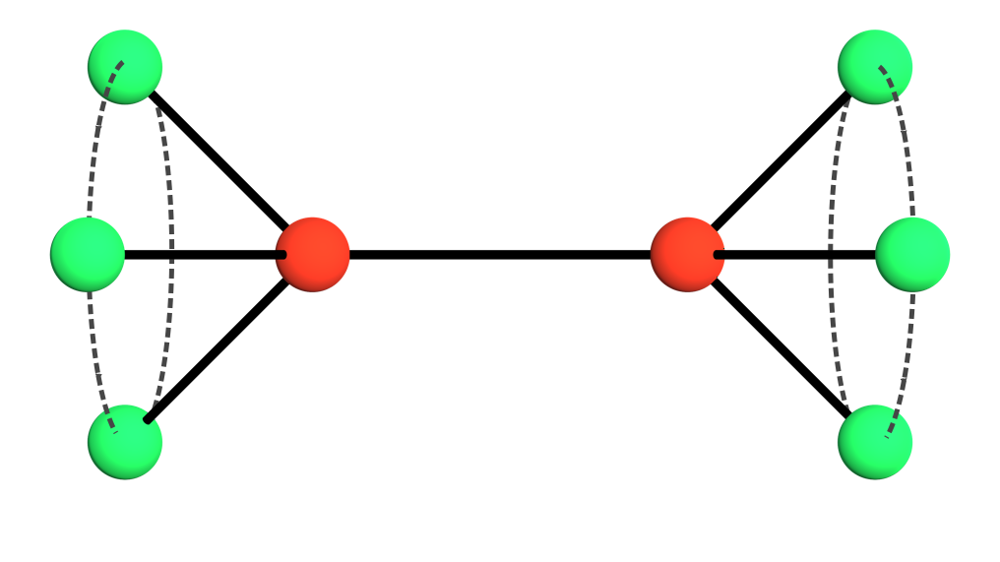

{: style="width:500px"}
# PMC - Predictive compression of molecular dynamics

Compression method for molecular dynamics trajectories exploiting the knowledge of molecular bonds.

## Bibtex
If you use our method in your research, please cite the original article:

```
@Article{predictive-compression-molecular-dynamics,
  author    = {
	Jan Dvo\v{r}\'{a}k and Martin Ma\v{n}\'{a}k and Libor V\'{a}\v{s}a
  },
  journal   = {Journal of Molecular Graphics and Modelling},
  title     = {Predictive compression of molecular dynamics trajectories},
  year      = {2020},
  issn      = {1093-3263},
  month     = may,
  pages     = {107531},
  volume    = {96},
  doi       = {10.1016/j.jmgm.2020.107531},
  publisher = {Elsevier {BV}},
}

```
	
##Contact

If you have any question regarding the PMC, feel free to contact the authors at <jdvorak@kiv.zcu.cz>, or by using issue tracking mechanism of the github repository.